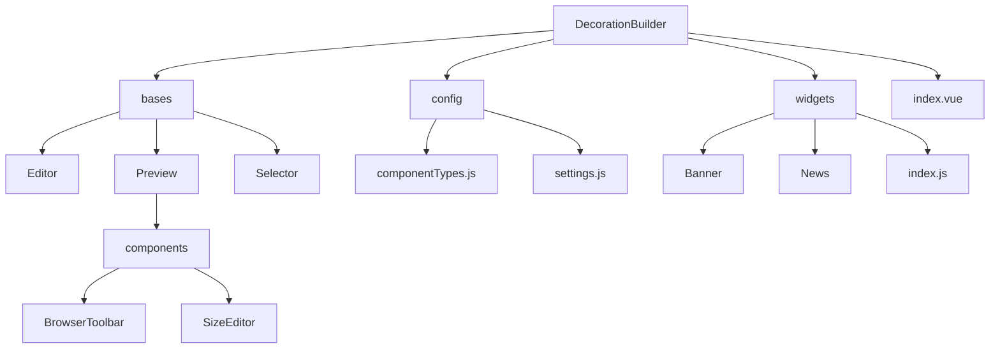

# 组件装修工具

一个基于 Vue 2 和 Ant Design Vue 1.x 的可视化组件装修工具，支持拖拽排序、属性编辑和实时预览。

## 功能特性

- 📱 **移动端预览**：支持自定义尺寸的移动端预览界面
- 🎨 **组件编辑**：实时编辑组件属性，所见即所得
- 📦 **组件库**：可扩展的组件库系统
- 🎯 **拖拽排序**：支持组件的拖拽排序功能
- 🔧 **尺寸调整**：可自定义预览区域尺寸，保持等比例缩放

## 技术栈

- Vue 2
- Ant Design Vue 1.x
- vuedraggable

## 目录结构

```
src/
├── components/
│   └── DecorationBuilder/          # 装修工具主目录
│       ├── bases/                  # 基础组件
│       │   ├── Editor/             # 属性编辑器
│       │   ├── Preview/            # 移动端预览组件
│       │   │   ├── components/     # 预览组件的子组件
│       │   │   │   ├── BrowserToolbar/ # 浏览器工具栏
│       │   │   │   └── SizeEditor/     # 尺寸编辑器
│       │   └── Selector/           # 组件选择器
│       ├── config/                 # 配置文件
│       │   ├── componentTypes.js   # 组件类型定义
│       │   └── settings.js         # 全局设置
│       ├── widgets/                # 自定义组件
│       │   ├── Banner/             # 轮播图组件
│       │   ├── News/               # 新闻列表组件
│       │   └── index.js            # 组件注册表
│       └── index.vue               # 装修工具主入口
└── utils/
    ├── componentUtils.js           # 组件相关工具函数
    └── index.js                    # 通用工具函数
```



## 核心组件说明

### 1. DecorationBuilder (主入口)
- 文件：`src/components/DecorationBuilder/index.vue`
- 功能：整合预览、编辑器和选择器组件，管理组件数据和交互逻辑

### 2. Preview (预览组件)
- 文件：`src/components/DecorationBuilder/bases/Preview/index.vue`
- 功能：展示移动端预览界面，支持组件拖拽排序
- 子组件：
  - BrowserToolbar：浏览器工具栏，包含预览、添加组件、发布等功能
  - SizeEditor：尺寸编辑器，用于调整预览区域大小

### 3. Editor (属性编辑器)
- 文件：`src/components/DecorationBuilder/bases/Editor/index.vue`
- 功能：动态加载组件编辑器，允许编辑组件属性

### 4. Selector (组件选择器)
- 文件：`src/components/DecorationBuilder/bases/Selector/index.vue`
- 功能：展示所有可用组件，支持选择组件添加到预览区

## 配置文件说明

### componentTypes.js
- 定义组件类型枚举和元数据
- 包含组件的显示名称、描述、图标等信息

```javascript
export const COMPONENT_TYPES = {
  BANNER: 'banner',          // 轮播图
  NEWS_LIST: 'news-list'     // 新闻列表
}

export const COMPONENT_METADATA = {
  [COMPONENT_TYPES.BANNER]: {
    name: '轮播图',
    description: '支持多张图片轮播展示',
    icon: 'picture',
    category: '基础组件'
  }
  // ...
}
```

### settings.js
- 全局配置文件，包含预览设置等

```javascript
export const PREVIEW_SETTINGS = {
  MOBILE_WIDTH: 375,         // 默认移动端宽度
  MOBILE_HEIGHT: 812         // 默认移动端高度
}
```

## 组件工具函数

文件：`src/utils/componentUtils.js`

主要功能：
- `getComponentMetadata()`：获取组件元数据
- `getAllComponentTypes()`：获取所有组件类型
- `getWidgetConfig()`：获取组件配置
- `getWidgetDefaultProps()`：获取组件默认属性
- `getWidgetPreview()`：获取预览组件
- `getWidgetEditor()`：获取编辑组件

## 组件映射关系

| 组件类型 | 组件名称 | 预览组件 | 编辑组件 |
|---------|---------|---------|---------|
| banner  | 轮播图   | BannerPreview | BannerEditor |
| news-list | 新闻列表 | NewsPreview | NewsEditor |

## 添加新组件指南

以添加一个"轮播的通知公告"组件为例：

### 1. 创建组件目录和文件

在 `src/components/DecorationBuilder/widgets/` 下创建新组件目录：

```
NotificationBanner/
├── index.js           # 组件配置文件
├── preview.vue        # 预览组件
└── editor.vue         # 编辑组件
```

### 2. 编写组件配置文件 (index.js)

```javascript
import NotificationBannerPreview from './preview.vue'
import NotificationBannerEditor from './editor.vue'
import { COMPONENT_TYPES } from '../../config/componentTypes'

export default {
  type: COMPONENT_TYPES.NOTIFICATION_BANNER,  // 需要在componentTypes.js中定义
  Preview: NotificationBannerPreview,
  Editor: NotificationBannerEditor,
  defaultProps: {
    // 组件默认属性
    notifications: [
      { id: 1, content: '通知内容1' },
      { id: 2, content: '通知内容2' }
    ],
    autoPlay: true,
    interval: 2000
  }
}
```

### 3. 编写预览组件 (preview.vue)

```vue
<template>
  <div class="notification-banner">
    <!-- 轮播的通知内容 -->
  </div>
</template>

<script>
export default {
  name: 'NotificationBannerPreview',
  props: {
    component: {
      type: Object,
      required: true
    }
  }
}
</script>

<style scoped>
/* 组件样式 */
</style>
```

### 4. 编写编辑组件 (editor.vue)

```vue
<template>
  <div class="notification-banner-editor">
    <!-- 属性编辑表单 -->
  </div>
</template>

<script>
export default {
  name: 'NotificationBannerEditor',
  props: {
    component: {
      type: Object,
      required: true
    }
  }
}
</script>
```

### 5. 注册组件类型

在 `src/components/DecorationBuilder/config/componentTypes.js` 中添加组件类型：

```javascript
export const COMPONENT_TYPES = {
  // ... 现有类型
  NOTIFICATION_BANNER: 'notification-banner'  // 新增通知公告类型
}

export const COMPONENT_METADATA = {
  // ... 现有元数据
  [COMPONENT_TYPES.NOTIFICATION_BANNER]: {
    name: '通知公告',
    description: '轮播展示通知内容',
    icon: 'bell',
    category: '基础组件'
  }
}
```

### 6. 注册组件

在 `src/components/DecorationBuilder/widgets/index.js` 中导入并注册新组件：

```javascript
import BannerComponent from './Banner'
import NewsComponent from './News'
import NotificationBannerComponent from './NotificationBanner'  // 导入新组件

export const widgets = [
  BannerComponent,
  NewsComponent,
  NotificationBannerComponent  // 注册新组件
]
```

## 开发和构建

### 安装依赖

```bash
npm install
```

### 启动开发服务器

```bash
npm run serve
```

### 构建生产版本

```bash
npm run build
```

### 运行 lint 检查

```bash
npm run lint
```

## 使用示例

```vue
<template>
  <div>
    <DecorationBuilder />
  </div>
</template>

<script>
import DecorationBuilder from '@/components/DecorationBuilder'

export default {
  components: {
    DecorationBuilder
  }
}
</script>
```

## 注意事项

1. 所有组件必须遵循相同的命名和目录结构
2. 新组件必须在 `componentTypes.js` 中定义类型和元数据
3. 预览组件和编辑组件必须正确导出
4. 默认属性应该在组件的 `index.js` 中定义
